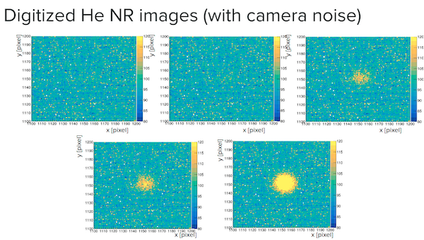

# IDAO 2021 Online Stage
**Team: CHAD DATA SCIENTISTS**

**Private test results pending**

* KUDOS to my teammates:
	- https://github.com/JustM57
	- https://github.com/KovalevEvgeny

## Instructions
1. Create "input", "output" folders in the root directory and place input files into the folder.
2. Branch `track-1` contains training files for <b>track-1</b> and <b>track-2</b> of the contest; `track-1` also contains submission postprocessing script
3. Branch `track-2` contains inference script to generate predicitons both for <b>track-1</b> and <b>track-2</b>
4. In other branches you can find features, that didn't work for us: Pseudolabelling for Regression model and Siamese network for one shot learning.

## Task description
The presence of Dark Matter (DM) in the Universe is nowadays an established, yet still mysterious, paradigm: deciphering its essence is one of the most compelling tasks for fundamental physics today. The nature of DM represents one of the key issues to understanding our Universe. Different models predict the existence of neutral particles with a mass of few GeV or higher that would fill our Galaxy. They could interact with the nuclei present in ordinary matter producing highly ionizing nuclear recoils (NR) with a kinetic energy as small as few keV. These NR would travel for hundreds to thousands of microns in gas leaving a trail of ionized atoms and free electrons.
Several experiments have been studied to detect those trails and possibly to reconstruct their main properties as position, direction, total amount of produced ionization. CYGNO collaboration is developing a technology able to collect those electrons on a structure where they produce photons, so that to have the possibility of creating images representing the 2D projection of the 3D NR trajectories.
PIC
Low energy photons produced by natural radioactivity can ionize electrons from atoms and molecules in the detector, producing recoils that would represent an important and dangerous background to Dark Matter signals. Electron recoils (ER) will produce distinctive and diverse patterns of ionization charge and therefore different images, given the different way they deposit energy and interact with matter.

Thus, NR and ER can be efficiently identified and separated down to low kinetic energies by studying the properties of the particle tracks.
In all cases, while traveling in gas, ionised electrons will be subject to diffusion effects that blur final images. Moreover, optical sensors used to collect the photons have a small, yet not negligible, electronic noise that adds up to physical signals.
In this competition we propose you images taken from 12 classes (6 classes of ER and 6 of NR) obtained by simulating detector response to ER and NR events with different energies.
The test asks to properly assign each image to the correct particle type (ER/NR) and reconstruct the particle angle. PIC PIC

<b>Objective</b> 
Your objective is to create a model that, given an event, outputs the energy of the particle.
In the data there are electrons, He nucleus and energies in the range 1, 3, 6, 10, 20, 30 keV - 12 classes in total. We split those classes into training classes and test classes, with 3, 10, 30 keV electrons and 1, 6, 20 keV He being training classes and the remaining six being the test classes.

## Model description
In our solution we chose to create 2 separate models: one for Classification and One for Regression, not to overfit to the public leaderboard. Both models are pure CNNs: for `track-1` we used DenseNet201 and for `track-2` we used MobileNetV2 for speed.
We also used some label postprocessing which increased the score in the end
